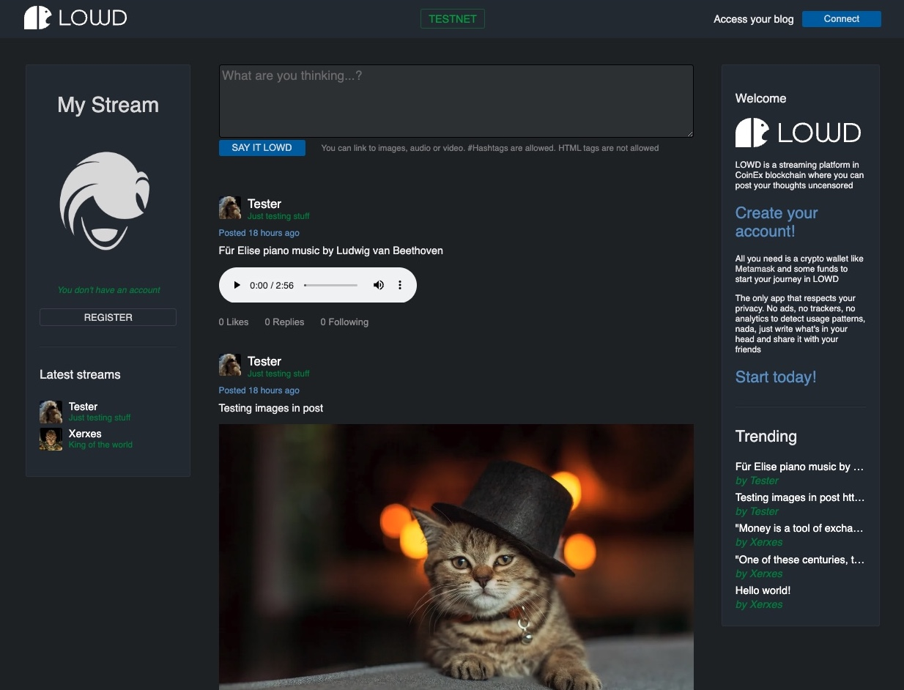

# LOWD
## Streaming platform in the blockchain

[LOWD](https://lowd.me) allows you to post your thoughts in short format, storing your content in the blockchain without censorship so you are the only one in control of your privacy and online presence

In order to use [LOWD](https://lowd.me) you will need [Metamask](http://metamask.io) to post content as all transactions are recorded forever in the blockchain

For the technically inclined, LOWD was developed using NodeJS and PostgreSQL on the server, plain HTML, JS, CSS on the client, Solidity for smart contract interaction and we are participating in MetaFi CoinEx Hackathon 2022

# SAY IT [LOWD](https://lowd.me)

@2022 LOWD - All rights reserved by Kuyawa